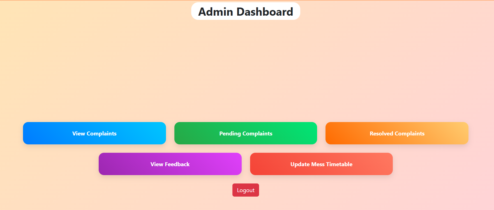

# Hostel Maintenance System

A web-based system for students to report hostel issues and track their status, while admins manage complaints, feedback, and mess timetable.

## Features
- Complaint management
- Admin dashboard
- Feedback system
- Mess timetable update

## Tech Stack
- Flask (Python)
- SQLite
- HTML, CSS, Bootstrap
## 📸 Screenshots

### Admin Dashboard

